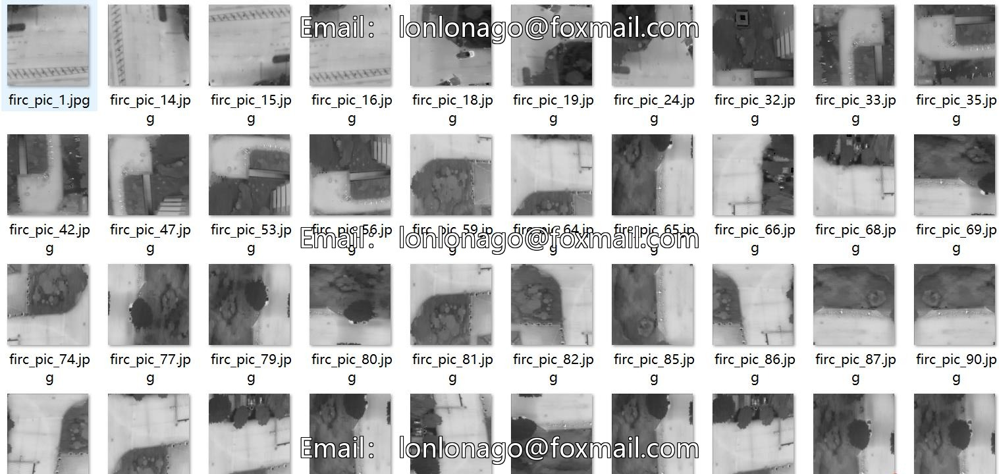
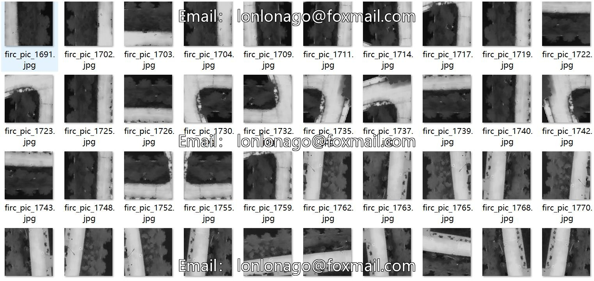
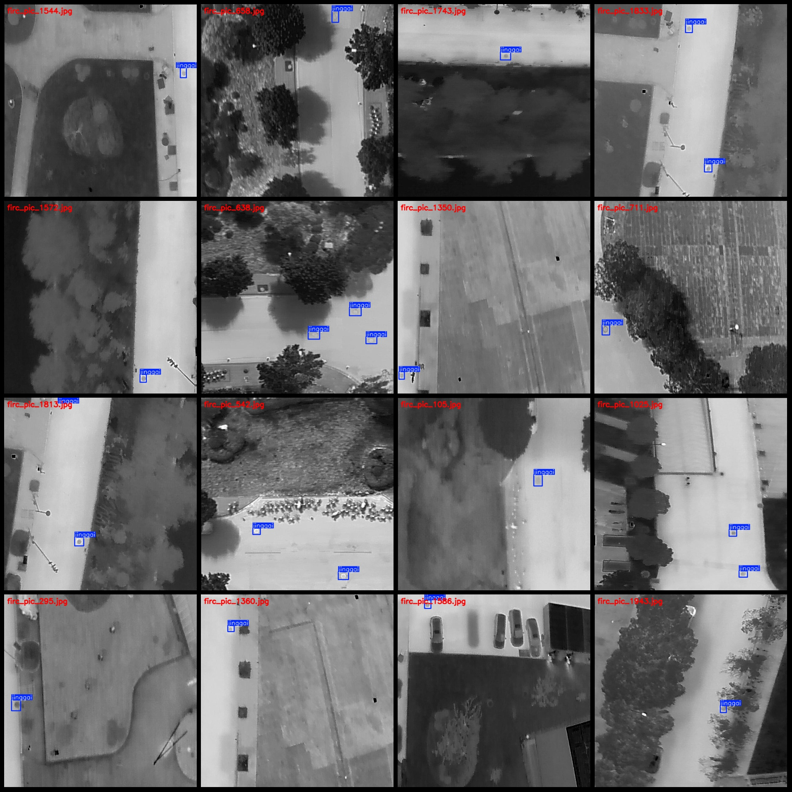
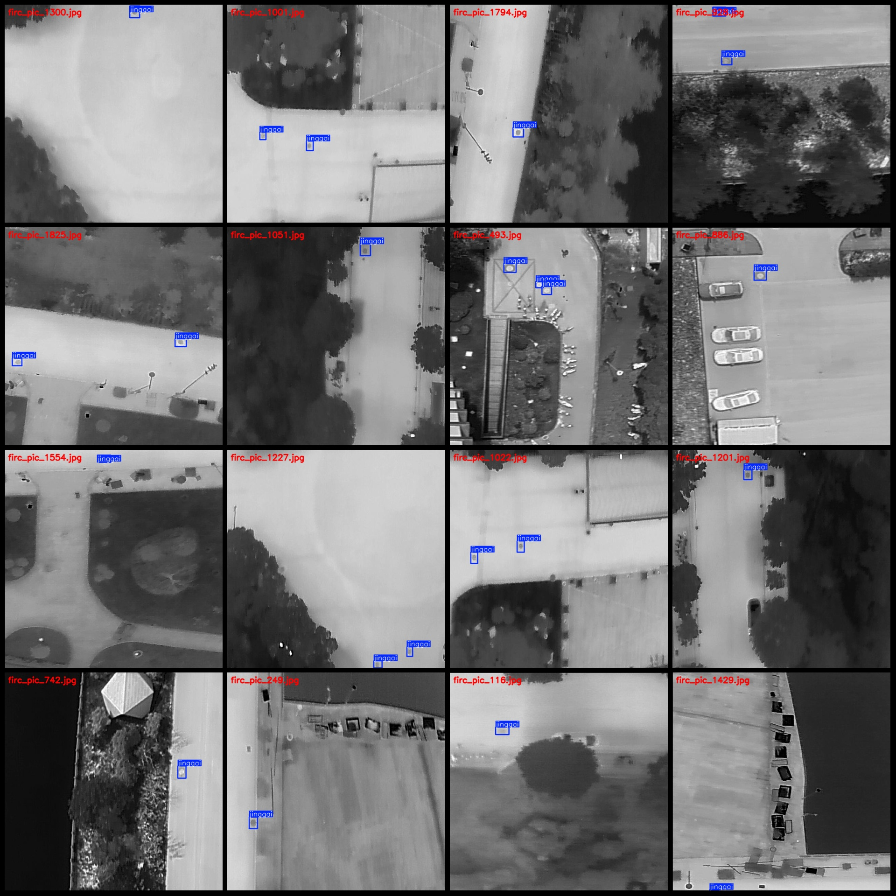

# Drone Perspective Thermal Infrared City Street Sewer Grate Detection Dataset VOC+YOLO Format 1021 Images 1 Category

Please note that this only involves detecting sewer grate covers, not defects.
The dataset format is Pascal VOC with YOLO format (excluding the split path's txt file, just containing jpg images and their corresponding VOC format xml files and YOLO format txt files).
Number of images (jpg file count): 1021
Number of annotations (xml file count): 1021
Number of annotations (txt file count): 1021
Number of annotation categories: 1
Annotation category name: ["jinggai"]
Number of bounding boxes per category: 1587
Total number of bounding boxes: 1587
Number of images each category occupies: 1021
Image resolution: 640x640
Annotation tool used: labelImg
Annotation rules: draw rectangle boxes for categories
Important note: The dataset does not have separate training, validation, or test sets. Please arrange them independently.
Special notice: This dataset does not guarantee the accuracy of models trained on it or the weights files.
Image preview:
Annotation example:

## Images

Here is a pay link on Stripe ( https://buy.stripe.com/3cs8yP7sY87d0vu9AB ). Please contact me lonlonago@foxmail.com after funding $89, and I will send you a complete data files , thank you!

